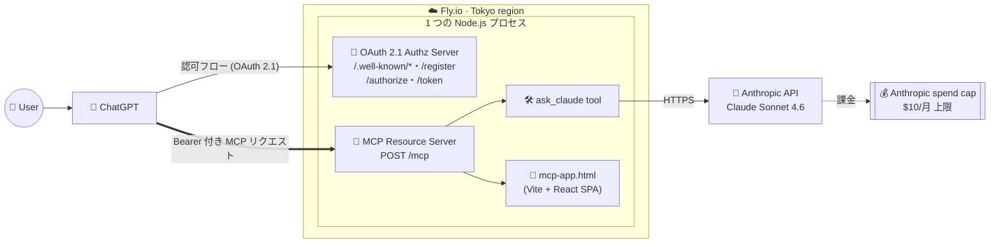

どうも！peitangosです。
MCP Appsで少し遊んでみました。意外と面白かったので、記事にしました。

今回やったことを一言で言うと、ChatGPT の会話の中に Claude の回答をカードとして生やすやつです。
つまり ChatGPT に何かを質問すると、ChatGPT 自身の回答に加えて「Claudeの答え」というオレンジのカードが同じ会話内にもう1枚ぽこっと出てきます。ライバルベンダー同士の LLM を 1 つの UI で同居させる構造ですね。


## はじめに

2026年1月26日、MCP 仕様に MCP Apps (別名 SEP-1865, `io.modelcontextprotocol/ui`) という拡張が初めて取り込まれました。

MCP 自体をざっくりおさらいしておくと、LLM ホスト (Claude Desktop, ChatGPT, Cursor, など) と外部ツールを繋ぐ共通プロトコルです。いわば「AI 版の LSP」みたいな立ち位置で、サーバー側が tool を 1 つ登録すれば、対応ホストならどこからでもそのツールを呼べる、というやつですね。

で、MCP Apps というのはその上に乗る UI 拡張で、一言で言うと:

> MCP サーバーが HTML (React でビルドしたやつ) を返せるようにして、ホスト側は iframe でそれを描画する

という仕組みです。ツール呼び出しの結果がテキストや JSON だけじゃなくて、リッチな UI コンポーネントになります。
しかも仕様上は「Write Once, Run Anywhere」を謳っていて、同じ MCP サーバーの HTML が Claude Desktop でも ChatGPT でも Cursor でも (対応していれば) そのまま動くことになっています。

今回はこの「ホストを越境する UI」という特性をフル活用して、ChatGPT の中で Claude の回答カードを描画させてみます。

## その機能が解こうとしている課題

そもそもなんでこんな拡張が入ったのかという話です。

MCP は登場してしばらくの間、ツール呼び出しの結果はテキスト or JSON しか返せませんでした。
これだと例えば「GitHub のリポジトリ一覧をリッチな表で出したい」とか「地図を埋めたい」とか「グラフを出したい」とかをやろうとしたとき、ホスト側 (Claude Desktop や ChatGPT) がそれぞれ独自にレンダラーを書く必要がありました。

- ホスト A: Markdown テーブルとして描画
- ホスト B: 独自の UI コンポーネントでカードとして描画
- ホスト C: 何もしない (生 JSON が表示される)

これ、ツール開発者から見ると「どのホストでどう見えるか」が完全に運任せでした。
MCP Apps はこの課題をシンプルに解決していて、ツール側が HTML を同梱すれば、どのホストも同じ見た目で iframe 描画する、という約束にしました。

つまりレンダリングの責任がホストからツール側に移った、というのが本質です。
ツール開発者は自分が期待する見た目を自分で保証できるようになり、代わりにホストは「安全に iframe を出す」ことだけに集中すればよくなりました。

この「ホストを越境して同じ UI が動く」という性質があるからこそ、今回のネタ — ChatGPT の会話の中で Claude の回答カードを描画する — が成立しています。Claude Desktop 向けに書いたコードとまったく同じ `mcp-app.html` が、ChatGPT の iframe にもそのまま描画されます。

## なにをしたか

ここからが本題です。

### できあがったもの

完成したのはこういう感じの MCP App です。

1. ChatGPT で「〇〇について教えて」と聞く
2. ChatGPT は普通に自分の回答をテキストで返す
3. 同時に `ask_claude` ツールを自動で呼ぶ
4. MCP サーバー (自前 Node.js) が Anthropic API で Claude を叩く
5. Claude の回答を structuredContent として返す
6. ChatGPT の会話内にオレンジのカードとして Claude の回答が生える

冷静に考えると Custom Connector が出た時点で、ChatGPT からバックエンド越しに Claude に問い合わせること自体はできました。ただ「UI として会話内に Claude の回答カードを描画する」のは MCP Apps が来るまで無理だったので、体験としては結構別物です。

### 全体のアーキテクチャ

最終的にクラウドにホストした後の全体像はこんな感じです。



登場人物は 4 つだけです。

1. ChatGPT — ユーザーが質問を打つ場所。MCP クライアントとしてサーバーを叩く
2. MCP サーバー (自前 Node.js, Fly.io にデプロイ) — ask_claude ツール / mcp-app.html リソース / OAuth 2.1 Authorization Server の 3 役を 1 プロセスで兼ねている
3. Anthropic API — Claude 本体。MCP サーバーから HTTPS で叩く
4. Anthropic spend cap — 認証が万一破られても月額いくらで絶対に頭打ちになる安全装置

同じ Node.js プロセスが Authorization Server + Resource Server + ツール実行 + UI 配信の 4 つを同時に受け持っていて、ここが MCP Apps 独特の構造です。UI (HTML) の配信まで MCP サーバー側が持つので、普通のフロントエンド + バックエンドの分離とは少し感覚が違います。その代わり、ホストを越境して (ChatGPT でも Claude Desktop でも) まったく同じ UI が動きます。

### 実装は 4 パーツだけ

中身もシンプルで、大きく分けて以下の 4 ファイルしかありません。

- `server.ts` — MCP サーバー本体。ask_claude ツール、mcp-app.html リソース、OAuth ルートの mount を行う
- `src/claude.ts` — Anthropic SDK の薄いラッパー。質問文字列を受け取って Claude の回答を返すだけ
- `src/main.tsx` — React 製 UI。ツール呼び出し結果を受け取ってオレンジのカードを描画するだけ
- `src/oauth.ts` — 自前の最小 OAuth 2.1 Authorization Server。後述する通り割り切って書いたら 300 行ちょっとに収まった

コード全体はリポジトリ ([peintangos/mcp-apps-sample](https://github.com/peintangos/mcp-apps-sample) の `projects/article-3/`) にあるので、興味がある方はそちらを覗いてみてください。この記事では細かい実装より「サーバーを外に置く」周りの話を掘り下げたいと思います。

## MCP サーバーを外に置くときの注意点

### cloudflared と「ちゃんとしたホスティング」の使い分け

最初は手軽さ重視で [cloudflared](https://developers.cloudflare.com/cloudflare-one/connections/connect-networks/do-more-with-tunnels/trycloudflare/) の quick tunnel で繋ぎました。

```bash
cloudflared tunnel --url http://localhost:3001
# → https://xxxx-yyyy-zzzz.trycloudflare.com が一瞬で発行される
```

これめちゃくちゃ便利で、ローカルの dev サーバーに HTTPS の URL が一瞬で生えるというやつです。`tsx watch` で iterate しながら ChatGPT から動作確認できるので、開発中はこれ一択。

ただし cloudflared quick tunnel は本質的に開発用です。プロセスを止めると URL が死ぬし、認証もないし、Cloudflare 公式も「demo / dev only」と言っています。記事を公開して読者にも試してもらう、みたいな話になると、Fly.io / Cloudflare Workers / Railway / Render あたりのちゃんとしたホスティングに置くのが筋です。

### 本当に怖いのは「API 課金焼き」

MCP サーバーを公開する時に一番気にすべきは、実は「URL がバレること」ではなくて API 課金の爆死リスクです。

想像してください。Fly.io に MCP サーバーを置いて安定 URL を手に入れた → 嬉しい → ついその URL を記事に書く → 悪意ある人がスクリプトで `ask_claude` を秒間 100 発叩く → 自分の ANTHROPIC_API_KEY で Claude Opus が無限に呼ばれる → 1 晩で数百ドル。

quick tunnel の時代は「URL が秘密っぽい」「止めれば消える」という天然の防壁が効いていましたが、ちゃんとしたホスティングに移った瞬間、その防壁が消えます。

### まず Anthropic Console の spend cap を入れる

この地雷を踏まないための最も効く最後の砦が、Anthropic Console の monthly spend cap です。Settings → Limits から月次の最大課金額を指定できて、仮に何が起きてもキャップを超えた瞬間に API が 429 を返し始めるので、物理的にそれ以上焼けなくなります。

実装コスト 0、画面でポチるだけ、強制的な上限。公開するなら真っ先にこれを入れるべきです。

## 認証まわりのちょっとした話

あともう 1 つ、ChatGPT に繋ぐときに地味に面倒だったのが認証です。

ChatGPT の Custom Connector の認証方式は OAuth / No Auth / Mixed の 3 つ。API Key がそもそも選べなくて、MCP 仕様が OAuth 2.1 を正規の方式として推しているので、そういう作りになっています。


というわけで、MCP サーバー側に OAuth 2.1 の Authorization Server を同居させる必要がありました。MCP 仕様は裏側で RFC 8414 / 7591 / 9728 + PKCE (S256) を要求してくるので、ドキュメント見ながら地道に書くしかないです。本気の OAuth プロバイダを作ろうとすると大仕事ですが、自分 1 人が使う前提でガッツリ割り切ると思ったよりは小さく収まりました。

触ってみて得た観点をポイントベースで残しておきます。

- ChatGPT Custom Connector は OAuth 2.1 + PKCE (S256) 必須で、API Key 共有方式は使えない
- 個人用途なら Authorization Server と Resource Server を 1 プロセスに同居させてよい。MCP 仕様もそれを許容している
- 同意画面は普通の HTML を 1 枚返すだけで成立する。テーマ色に合わせてオレンジにしたらそれっぽい見た目になった
- トークンはインメモリの Map で十分。再起動したら再ログインが必要になるけど、個人用途なら許容範囲
- Anthropic Console の spend cap と併用しておけば、認証が万一突破されても課金被害は絶対額で頭打ちになる

自作 OAuth サーバーが返す同意画面はこんな感じ。`/authorize` に飛んできたときにサーバーが返すだけのシンプルな HTML です。


実装は `src/oauth.ts` に 300 行ちょっとで全部入っているので、興味があれば覗いてみてください。

## 最後に

いかがでしたでしょうか。割と遊び半分でやってみましたが、ライバルベンダーの LLM が 1 枚の UI で握手する体験は意外と未来感があって面白かったです。

今回やったことを改めて整理すると:

- MCP Apps のおかげで、ツールの結果を iframe でリッチに描画できるようになった
- Write Once, Run Anywhere という触れ込みは本物で、同じ `mcp-app.html` が ChatGPT でも Claude Desktop でもそのまま動いた
- 公開するなら Anthropic Console の spend cap を真っ先に入れる。これを忘れると API 課金が焼かれる
- 開発中は cloudflared quick tunnel、公開は Fly.io などのちゃんとしたホスティング、という使い分けが落ち着きどころ
- ChatGPT の Custom Connector は OAuth 2.1 前提なので、サーバー側に最小 Authorization Server を同居させる

コードはすべて GitHub リポジトリ ([peintangos/mcp-apps-sample](https://github.com/peintangos/mcp-apps-sample)) の `projects/article-3/` 配下にあります。`.env.example` をコピーして `ANTHROPIC_API_KEY` と `OAUTH_OWNER_PASSWORD` をセットして `npm install && npm run build && npm start` したら、ローカルでそのまま動きます (ローカル開発だけなら `OAUTH_OWNER_PASSWORD` は空のままでも可、その場合 OAuth は無効化されます)。
Fly.io にデプロイするための `Dockerfile` と `fly.toml` もリポジトリに入っているので、`fly deploy` で同じ構成を再現できます。

次は何を書くかまだ決めていないですが、MCP Apps 越しに複数 LLM を束ねる方向はまだまだ掘れそうなので、Gemini や Llama を足した「LLM 合議制」みたいなネタも面白いかもな〜とぼんやり考えています。

## 参考文献

- [Model Context Protocol (公式)](https://modelcontextprotocol.io/)
- [OAuth 2.1 draft (IETF)](https://datatracker.ietf.org/doc/html/draft-ietf-oauth-v2-1)
- [RFC 7636 — Proof Key for Code Exchange (PKCE)](https://datatracker.ietf.org/doc/html/rfc7636)
- [RFC 8414 — OAuth 2.0 Authorization Server Metadata](https://datatracker.ietf.org/doc/html/rfc8414)
- [RFC 7591 — OAuth 2.0 Dynamic Client Registration Protocol](https://datatracker.ietf.org/doc/html/rfc7591)
- [RFC 9728 — OAuth 2.0 Protected Resource Metadata](https://datatracker.ietf.org/doc/html/rfc9728)

おわり。
