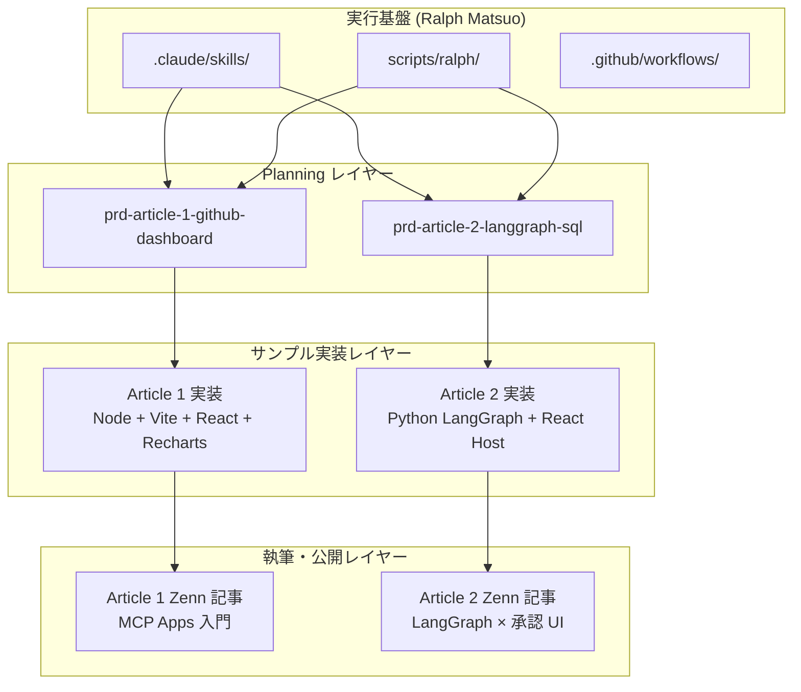
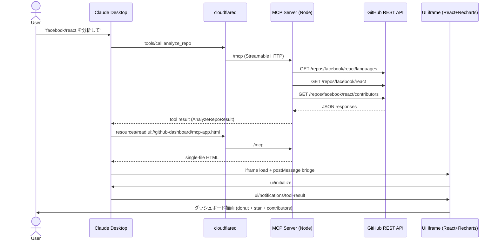
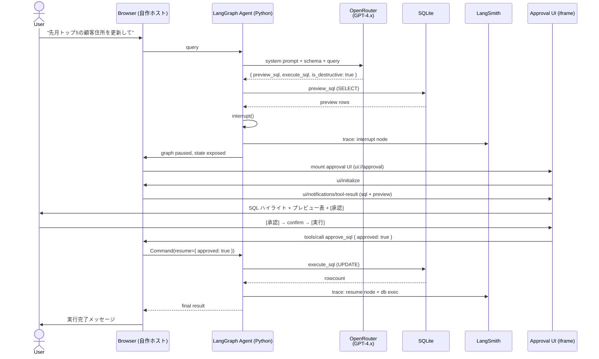

# Architecture

## Summary

`mcp-apps-sample` は、MCP Apps (SEP-1865) の技術検証と Zenn 記事公開を目的としたデモリポジトリである。ドキュメント駆動の開発フローは Ralph Matsuo テンプレート上に構築されており、PRD / 仕様 / todo / progress の 4 層構造でプロジェクトの進行を管理する。リポジトリ内で 2 本の独立したサンプルプロジェクト (Article 1 / Article 2) を同時に育てる構造になっている。

Ralph Matsuo テンプレート部分 (Claude Code skills, Ralph Loop, GitHub Actions) は PRD 駆動の執行レイヤーとしてそのまま利用し、サンプルプロジェクトごとに独自の技術スタックを持つ。

## Layered View



## Tech Stack

### テンプレート共通 (実行基盤)

- Runtime: Bash and Node.js
- Languages: Markdown, Bash, YAML, TOML
- Package manager: npm
- Command registry: `ralph.toml`
- Automation: Git, GitHub Actions, Claude Code CLI

### Article 1: GitHub Dashboard MCP App

- Runtime: Node.js 20 LTS
- Language: TypeScript 5.x
- MCP: `@modelcontextprotocol/sdk`, `@modelcontextprotocol/ext-apps`
- HTTP: `express` + `cors` (Streamable HTTP トランスポート)
- Build: Vite 5 + `vite-plugin-singlefile`
- UI: React 18 + Recharts 2.x
- 外部 API: GitHub REST (`api.github.com`)
- 検証ホスト: `basic-host` (ローカル) → Claude Desktop (`cloudflared` 経由)

### Article 2: LangGraph × MCP Apps

- Runtime: Python 3.11 以上 + Node.js 20 (フロントエンド)
- エージェント: `langgraph`, `langchain-openai`, `langchain-mcp-adapters`
- モデル: OpenRouter 経由の GPT-4.x 系
- DB: SQLite (標準ライブラリ)
- Observability: `langsmith`
- フロントエンド: React + Vite (自作 MCP Apps ホスト)
- 検証ホスト: 自作ホストのみ (Claude Desktop 非対応)

## Runtime Surfaces

| Surface | Purpose | Location |
|---------|---------|----------|
| Planning docs | PRD / 仕様 / todo / progress / knowledge / dependencies | `docs/prds/prd-article-*/` |
| Article outlines | 各記事の確定した骨子 | `docs/references/article-outlines/` |
| Reference material | MCP Apps 関連の調査レポート (6 本) | `docs/references/MCP Apps/` |
| Ubiquitous glossary | プロジェクト横断の用語定義 | `docs/ubiquitous/glossary.md` |
| Interactive workflow | Claude Code スラッシュコマンド | `.claude/skills/` |
| Claude hooks / rules | ガードレールと規約 | `.claude/hooks/`, `.claude/rules/` |
| Headless workflow | Ralph Loop による自律実行 | `scripts/ralph/` |
| CI automation | PRD 起票と Ralph Loop | `.github/workflows/` |
| Local validation | リポジトリ規約と回帰検査 | `package.json`, `scripts/` |
| Sample project (Article 1) | GitHub Dashboard MCP App の実装 | TBD: `projects/article-1/` (spec-001 で作成予定) |
| Sample project (Article 2) | LangGraph × 承認 UI の実装 | TBD: `projects/article-2/` (PRD 2 開始時に作成予定) |

## Repository Structure

```text
[repo root]
├── CLAUDE.md
├── README.md                 # mcp-apps-sample の入口 + Ralph Matsuo 説明
├── ralph.toml
├── package.json              # リポジトリ規約検査用
├── .claude/
│   ├── agents/
│   ├── skills/
│   ├── rules/
│   ├── hooks/
│   └── settings.json
├── docs/
│   ├── architecture.md       # (この文書)
│   ├── roadmap.md            # Active PRDs と記事計画
│   ├── references/
│   │   ├── MCP Apps/         # MCP Apps 調査レポート (6 本)
│   │   └── article-outlines/ # 記事の骨子
│   ├── ubiquitous/
│   │   └── glossary.md
│   └── prds/
│       ├── _template/
│       ├── prd-article-1-github-dashboard/
│       │   ├── prd.md
│       │   ├── progress.md
│       │   ├── todo.md
│       │   ├── knowledge.md
│       │   ├── dependencies.md
│       │   └── specifications/
│       │       ├── spec-001-project-bootstrap.md
│       │       ├── spec-002-github-analyze-tool.md
│       │       ├── spec-003-dashboard-ui.md
│       │       ├── spec-004-claude-desktop-integration.md
│       │       └── spec-005-zenn-article-publish.md
│       └── prd-article-2-langgraph-sql/
│           ├── prd.md
│           ├── progress.md
│           ├── todo.md
│           ├── knowledge.md
│           ├── dependencies.md
│           └── specifications/
│               ├── spec-001-langgraph-sqlite-bootstrap.md
│               ├── spec-002-custom-mcp-apps-host.md
│               ├── spec-003-approval-ui.md
│               ├── spec-004-interrupt-integration.md
│               ├── spec-005-langsmith-tracing.md
│               └── spec-006-zenn-article-publish.md
├── scripts/
│   ├── ralph/
│   └── (lint-repo.sh, test-*.sh)
├── infra/                    # (optional) CDK for EC2 runner
└── .github/
    ├── ISSUE_TEMPLATE/
    ├── scripts/
    └── workflows/
```

**Note**: 実装コード (`projects/article-1/`, `projects/article-2/`) は各 PRD の spec-001 で生成される。現時点では未作成。

## Article 1 — Control Flow



主な技術的ポイント:

- **トランスポート**: MCP サーバーは Streamable HTTP で公開される (stdio は使わない)
- **CSP 宣言**: `_meta.ui.csp.connectDomains: ["https://api.github.com"]`、`resourceDomains: ["https://avatars.githubusercontent.com"]`
- **UI バンドル**: Vite + `vite-plugin-singlefile` で単一 HTML にビルド、`registerAppResource` から配信
- **iframe 通信**: `postMessage` 上で JSON-RPC 2.0、`@modelcontextprotocol/ext-apps/react` の `useApp()` を使用

## Article 2 — Control Flow



主な技術的ポイント:

- **自作ホスト必須**: `langchain-mcp-adapters` は `_meta.ui.resourceUri` を扱わないため、MCP Apps の UI 描画はフロントエンド (自作ホスト) が担う
- **承認チャネル**: UI → LangGraph の信号パスは MCP ツール呼び出し (`approve_sql`) として実装
- **interrupt**: LangGraph v0.2 以降の `interrupt()` + `Command(resume=...)` を使用
- **LangSmith**: LangGraph 側のみ trace する。MCP App iframe 内の postMessage は trace 対象外

## Planning Control Flow

```mermaid
flowchart LR
    A[Idea / 記事構想] --> B[/prd-create]
    B --> C[docs/prds/prd-article-*/]
    C --> D[/spec-create]
    D --> E[specifications/]
    E --> F[/implement]
    F --> G[demo 実装コード]
    G --> H[/test, /build-check, /code-review]
    H --> I[/commit-push]
    I -- 次タスク --> F
    G --> J[Zenn 記事ドラフト執筆]
    J --> K[記事公開]
    K --> L[knowledge.md に URL 記録]
```

## Execution Modes

| Mode | Entry point | Use case |
|------|-------------|----------|
| Interactive | `/catchup` → `/implement` → `/commit-push` | 記事執筆者が 1 タスクずつ進める通常の作業 |
| Autonomous | `scripts/ralph/ralph.sh --prd docs/prds/prd-article-1-github-dashboard` | まとめて複数タスクを進めたい時の自律実行 |
| GitHub Actions | `.github/workflows/ralph.yml` (manual dispatch / schedule) | サーバー側で Ralph Loop を回す場合 |

## Validation Commands

- Canonical registry file: `ralph.toml`
- Standard roles: `test_primary`, `test_integration`, `build_check`, `lint_check`, `format_fix`
- 現状: この PRD 段階ではテンプレート既定値のまま。サンプル実装 (Article 1 の spec-001) が入った時点で、Article 1 / Article 2 用のコマンドを `ralph.toml` に追記する計画

## External Dependencies

### 共通 (テンプレート基盤)
- Claude Code CLI (`claude`)
- Git、任意で GitHub CLI (`gh`)
- `jq` (Claude hook スクリプト用)
- `ANTHROPIC_API_KEY` (GitHub Actions 自動化時)

### Article 1 用 (spec-001 以降)
- Node.js 20 LTS、npm
- `cloudflared` CLI (Claude Desktop 検証時)
- Claude Desktop (Pro プラン相当、End-to-End 検証時)
- GitHub API 公開アクセス (`api.github.com`、認証なしで可)

### Article 2 用 (将来)
- Python 3.11 以上
- OpenRouter API キー (`OPENROUTER_API_KEY`)
- LangSmith API キー (`LANGSMITH_API_KEY`)
- SQLite 3 (標準ライブラリ)
- ブラウザ (Chrome / Firefox)

## Boundaries and Non-Goals

- **プロダクトランタイムではない**: このリポジトリはデモと記事のためのものであり、運用を前提としない
- **複数ホスト検証は行わない**: Article 1 は Claude Desktop のみ、Article 2 は自作ホストのみ
- **コードの共有はしない**: Article 1 と Article 2 は実装を共有せず、各 PRD ディレクトリ配下に独立して存在する
- **認証・本番 DB・決済などの本格機能は扱わない**: 記事読者が 10 分で再現できることを優先する
