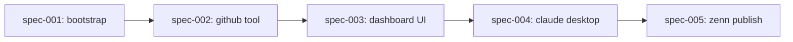

# Dependencies — Article 1: GitHub Dashboard MCP App

## Dependency Graph

## Implementation Order

| Order | Specification | Depends On | Why This Order | Notes |
|-------|---------------|------------|----------------|-------|
| 1 | spec-001-project-bootstrap | none | 自明な `hello_time` ツールで MCP Apps の往復を最初に確立し、後続の spec が GitHub API 由来の問題と MCP Apps 配線由来の問題を切り分けられるようにする | 安全弁: CSP と GitHub API を同時に触らない |
| 2 | spec-002-github-analyze-tool | spec-001 | UI が実データを描画する前に、サーバー側のデータ取得が確定している必要がある | rate limit / 404 は tool 側で構造化して吸収する |
| 3 | spec-003-dashboard-ui | spec-002 | UI は spec-002 で定義されたツール出力の shape に対して作る | Recharts を使い、`ontoolresult` でデータを受ける |
| 4 | spec-004-claude-desktop-integration | spec-003 | ホストレベルの検証には動く demo と正しい CSP 宣言の両方が必要 | 記事用スクリーンショットもここで取得する |
| 5 | spec-005-zenn-article-publish | spec-004 | 記事は動いているコードと実スクリーンショットを参照するため、demo が完全に検証された後に書く | 公開前に `/code-review` と `docs-review` を通す |
