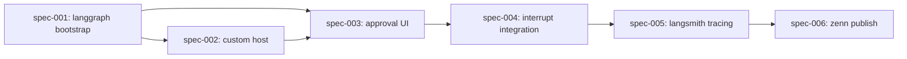

# Dependencies — Article 2: LangGraph × MCP Apps × Human-in-the-loop SQL

## Dependency Graph

## Implementation Order

| Order | Specification | Depends On | Why This Order | Notes |
|-------|---------------|------------|----------------|-------|
| 1 | spec-001-langgraph-sqlite-bootstrap | none | LangGraph + OpenRouter + SQLite が動かないと他の spec は検証できない | SELECT のみで動作確認 |
| 2 | spec-002-custom-mcp-apps-host | spec-001 | 自作ホストは LangGraph のイベントを受けて UI を描画するので、LangGraph 側の最小動作が先 | `basic-host` をベースにする |
| 3 | spec-003-approval-ui | spec-001, spec-002 | UI は SQL の shape (spec-001) と iframe を載せる枠 (spec-002) が両方必要 | Recharts は使わず SQL + table 中心 |
| 4 | spec-004-interrupt-integration | spec-003 | 承認 UI が動いた後でないと interrupt フローの検証ができない | UI → LangGraph の承認チャネル決定も含む |
| 5 | spec-005-langsmith-tracing | spec-004 | trace 対象の完全なフローは interrupt 統合後に初めて成立する | スクショ取得もここ |
| 6 | spec-006-zenn-article-publish | spec-005 | 記事は全スクショとコードが揃った後に書く | Article 1 と同様のレビュー手順 |
