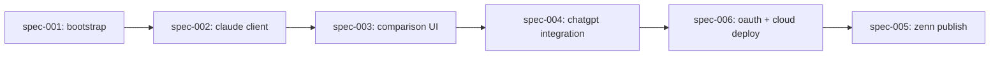

# Dependencies — Article 3: ChatGPT × Claude Second Opinion MCP App

## Dependency Graph

## Implementation Order

| Order | Specification | Depends On | Why This Order | Notes |
|-------|---------------|------------|----------------|-------|
| 1 | spec-001-project-bootstrap | none | Article 1 の構成から流用する雛形を用意し、最小 `ask_claude` (hardcode) で MCP Apps の往復が通ることを確認 | この段階では Claude API は呼ばない (SDK の import 確認のみ) |
| 2 | spec-002-claude-api-client | spec-001 | 実際の Claude API 呼び出しを `src/claude.ts` に切り出し、ツール handler を差し替える | `Result<T>` 型で rate limit / 401 / network エラーを構造化 |
| 3 | spec-003-comparison-ui | spec-002 | tool が実データを返せるようになってから 2 カラム比較 UI を構築 | `react-markdown` 導入、ThemeContext は Article 1 から流用 |
| 4 | spec-004-chatgpt-integration | spec-003 | UI が完成してから ChatGPT の Custom Connector で実機検証 | ChatGPT で動かない制約があれば Claude.ai にフォールバックし、記事にその制約を明記 |
| 5 | spec-006-oauth-cloud-deploy | spec-004 | cloudflared の "dev only" ホスティングから Fly.io に昇格、OAuth 2.1 最小実装で ChatGPT Custom Connector の認証要件を満たす | ChatGPT が `API Key` 認証を提供しないので OAuth 自前実装が必須。Anthropic spend cap と併用 |
| 6 | spec-005-zenn-article-publish | spec-006 | OAuth 実装まで終わってから Zenn 公開 | OAuth の話は記事の 1 章として組み込む |
