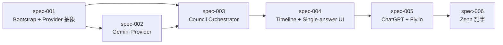

# Dependencies — Article 4: ChatGPT 主催の LLM 合議 MCP App

## Dependency Graph

## Implementation Order

| Order | Specification | Depends On | Why This Order | Notes |
|-------|---------------|------------|----------------|-------|
| 1 | spec-001-project-bootstrap-and-provider-abstraction | none | Article 3 から派生して `projects/article-4/` を立ち上げ、`ProviderClient` 抽象と Article 3 の Claude クライアントの移植を先行させる | Article 3 の `src/claude.ts` はそのままは取り込まず、抽象経由に差し替える |
| 2 | spec-002-gemini-provider-client | spec-001 | Provider 抽象が定義されてから Gemini 実装を追加する方が手戻りが少ない | `@google/genai` (Google AI Studio 版) を採用 |
| 3 | spec-003-council-orchestrator | spec-001, spec-002 | Claude / Gemini 両方の Provider が整ったあとでないと 3 ラウンド合議は組めない | Round 2 は `Promise.allSettled` で並列化、Round 3 は Claude を synthesizer 役に再利用 |
| 4 | spec-004-timeline-and-single-answer-ui | spec-003 | 3 ツールすべてが動くようになってから UI 分岐を繋ぐ | basic-host でローカル検証、Article 3 の `ThemeContext` と `AnswerColumn` を流用 |
| 5 | spec-005-chatgpt-integration-and-deploy | spec-004 | UI まで動いた段階で ChatGPT Custom Connector に登録し Fly.io にデプロイする | Article 3 の OAuth / Fly.io 設定を最大限再利用 |
| 6 | spec-006-zenn-article-publish | spec-005 | 実機検証スクショが揃ってから記事を執筆する | Article 3 からの連続ナラティブを意識し、Appendix で OpenRouter に言及 |
