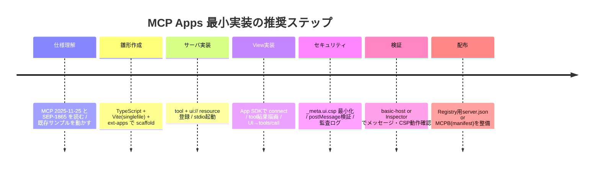

# MCP Apps（Model Context Protocol Apps）包括的技術サーベイ 2026-04-12版

## エグゼクティブサマリー

MCP（Model Context Protocol）は、LLMホストと外部ツール／データ提供サーバーの間を、JSON-RPC 2.0をベースに標準化するプロトコルで、仕様は日付版（`YYYY-MM-DD`）で運用され、現行版は`2025-11-25`として公開されています。citeturn15view0turn12view0turn10search3 MCPの標準トランスポートは「stdio」と「Streamable HTTP」の2系統で、Streamable HTTPではDNS Rebinding対策として`Origin`ヘッダ検証などが明確に要求されます。citeturn13view0 HTTP系トランスポートの認可はOAuth 2.1を中核に据え、保護リソースメタデータ（`.well-known`）やPKCE要件などが仕様化されています。citeturn14view3

MCP Appsは、このMCPに「サーバーが“UI”を配布できる」拡張を加える最初の公式拡張仕様（SEP-1865）で、安定版として`2026-01-26`が公開されています。citeturn21view0turn20view2turn8search4 仕組みはシンプルで、**MCP Apps = Tool + UI Resource**（`ui://`スキームのResource）という2点セットが基本です。ホストは`tools/list`でツールを発見し、`resources/read`で`text/html;profile=mcp-app`のHTMLを取得して**iframe内でレンダリング**します。citeturn5view1turn21view0turn28view3 UIとホストの通信は**`postMessage`上のJSON-RPC 2.0**で、SDK利用も生実装も可能です。citeturn7view1turn10search1turn10search3

セキュリティの要点は「（1）サンドボックス化されたiframe（Webホストでは推奨の二重iframe “Sandbox proxy”）、（2）UIが必要とする外部通信先を事前申告するCSPメタデータ、（3）監査可能なJSON-RPCメッセージ」の多層防御です。citeturn7view0turn21view2turn28view2turn27view2 実装者視点では、**CSP（`connect-src`等）とpostMessage検証（`targetOrigin`固定・`event.origin`検証）**が最初の安全境界になります。citeturn9search1turn10search1turn10search2

配布／発見（ディスカバリ）は、公式MCP Registry（現在プレビュー）と`server.json`により標準化が進んでいます。citeturn15view2turn15view1 さらに、ローカル配布を“拡張バンドル”としてまとめるMCPB（`.mcpb`＋`manifest.json`）も仕様化されており、ユーザー設定（秘密情報含む）・ローカライズ資材などを含めた配布が可能です。citeturn11view0turn2view2

本レポートは、公式仕様・参照実装・UI埋め込み／サンドボックス・通信API／メッセージフロー・パッケージング／権限・ツールチェーン・非機能（性能・アクセシビリティ・i18n・オフライン）・法務／プライバシーを、記事執筆可能な粒度で横断整理し、最後に最小実装計画（構成案＋コード断片＋開発タイムライン）を提示します。citeturn6view3turn5view1turn27view2

## MCPとMCP Appsの公式仕様・バージョン

### MCPコア仕様のバージョニングと“仕様の正本”

MCPのプロトコル版は`YYYY-MM-DD`形式の文字列で、**後方互換を破る変更が最後に入った日**を示します。現行（Current）は`2025-11-25`です。citeturn15view0turn12view0 バージョン交渉は初期化（initialize）時に行われ、クライアント／サーバーは複数バージョンをサポートし得ますが、セッション中は単一バージョンに合意する必要があります。citeturn15view0turn13view0

仕様の“ソース・オブ・トゥルース”はTypeScriptのスキーマで、JSON Schemaはそこから自動生成されます。citeturn14view0turn12view0 JSON Schemaの取り扱いとして、明示がない場合のデフォルト方言は2020-12であり、実装は少なくとも2020-12をサポートすることが求められています。citeturn14view1

### MCPの基盤：JSON-RPC、トランスポート、認可

MCPの全メッセージはJSON-RPC 2.0に従います。citeturn12view0turn10search3 標準トランスポートは、（a）サブプロセス起動型のstdio、（b）HTTP POST/GETと（必要に応じて）SSEストリーミングを組み合わせたStreamable HTTPです。citeturn13view0 Streamable HTTPにはローカルサーバーを遠隔Webサイトから叩かれる危険（DNS Rebinding等）があるため、`Origin`ヘッダ検証やlocalhostバインド推奨などの要件が明示されます。citeturn13view0

HTTPベースの認可はOAuth 2.1を中核に、保護リソースメタデータ（RFC9728）を必須、`WWW-Authenticate`の取り扱い、PKCE（S256）必須など、相当踏み込んだ規定があります。citeturn14view3

### MCP Apps（SEP-1865）の位置づけとスコープ

MCP AppsはMCPの拡張で、拡張IDは`io.modelcontextprotocol/ui`です。citeturn21view0 「サーバーがホストへ対話的UIを届ける」ための標準で、最初のMVPは**HTML（`text/html;profile=mcp-app`）**に焦点を当て、将来拡張の余地を残しています。citeturn21view0turn28view3

背景として（コミュニティ発の）MCP-UIや、entity["company","OpenAI","ai company"]のApps SDKなど、既存の“エージェントUI”の実践が影響したことが明記されています。citeturn21view0turn27view2turn27view1  
重要な注意点は、**ホスト実装は単一ではなく、ホスト依存の要素（例：UIを配置する専用ドメインの形式や検証ルール）が仕様上「ホスト依存」とされる**点です。citeturn21view3turn28view1 したがって「動く最小実装」は作れても、「全ホストで同一UX・同一制約」は前提にしない設計が現実的です。

## 参照実装・SDK・サンプルとエコシステム

### 公式リファレンスの全体像（何をフォークすべきか）

MCPコアの理解と検証に最短で効くのは、（1）公式仕様＋スキーマ、（2）公式リファレンスサーバー、（3）検査ツール（Inspector）の3点です。citeturn12view0turn19view1turn17search0

公式のExample Serversページでは、参照用のサーバーとしてEverything／Fetch／Filesystem／Git／Memory等が案内されています（いずれも教育用で、プロダクション用途では独自の安全対策が必要という注意も明確です）。citeturn19view1turn19view0

MCP Appsについては、公式拡張SDK兼仕様リポジトリ（ext-apps）が中心で、View（UI）側・ホスト埋め込み側・サーバー登録側の3役をカバーするパッケージ群が提供されています。citeturn20view4turn27view2

### MCP Apps SDK（ext-apps）の構成と成熟度

ext-appsは「UI開発者」「ホスト開発者」「サーバー作者」の役割に対応して、概ね次のモジュールを提供すると説明されています：View用（`App`クラス等）、Reactフック、ホスト埋め込み（app-bridge）、サーバー登録（server）。citeturn20view4turn27view2  
仕様（SEP-1865）は`2026-01-26`安定版として固定されていますが、SDK自体は継続的にリリースが進んでおり、2026年3月末〜4月頭にも複数のバージョン更新（例：v1.3.x〜v1.5.0）が出ています。citeturn8search0turn8search2

実務的な評価としては、**仕様は安定版**、**SDKは“活発に進化する安定運用期”**という位置づけが妥当です（＝記事では「SDKバージョン固定の前提」を明示すると安全）。citeturn8search0turn8search4

### 表示サンプル／スターターテンプレート

ext-appsリポジトリには、Map／Three.js／PDF Server等のデモアプリ集と、同一アプリを複数フレームワークで実装したスターターテンプレート（React/Vue/Svelte/Preact/Solid/Vanilla JS）が同梱されています。citeturn20view0turn19view2  
これらは「記事でフォークして説明する」用途に最適です。特にスターターテンプレートは、フレームワーク比較記事（Which stack?）のベースとしてそのまま使えます。citeturn20view0

### 開発・検証ツール：MCP Inspector

MCP InspectorはMCPサーバーをテスト／デバッグするための公式ツールとして文書化され、ブラウザUIからstdio/Streamable HTTPなど複数トランスポートに接続し、tools/resources/promptsや通知ストリームを確認できるとされています。citeturn17search0turn17search1  
リポジトリのREADMEでは、ReactベースのWeb UIと、各種トランスポートを“橋渡し”するNode.jsプロキシの2要素構成であることが説明されています。citeturn17search2

### 配布・発見：MCP Registry（プレビュー）とMCPB

公式MCP Registryは「公開MCPサーバーのための中央メタデータリポジトリ」として位置づけられ、`server.json`形式で、名前・場所（npm/OCI/リモートURL等）・実行方法などを標準化します。現状はプレビューで、破壊的変更やデータリセットの可能性が明示されています。citeturn15view2turn15view1

MCPBは、ローカルサーバー配布を1ファイルにまとめられる形式（zip＋`manifest.json`）として整理され、`manifest_version: "0.3"`（2025-12-02時点）などの仕様が公開されています。citeturn11view0turn2view2  
manifestには、サーバー起動コマンドやユーザー設定（sensitive属性）・ローカライズ資材指定（`localization.resources`）等が含められます。citeturn11view0

## UIリソース形式と埋め込みモデル

image_group{"layout":"carousel","aspect_ratio":"16:9","query":["MCP Apps architecture diagram iframe postMessage","Model Context Protocol host client server diagram","sandbox proxy double iframe architecture diagram","MCP Apps UI resource ui:// diagram"],"num_per_query":1}

### UIリソースの“仕様上の正解”：`ui://` + HTML（`text/html;profile=mcp-app`）

MCP AppsのUIは、MCP Resourceとして宣言され、URIは`ui://`スキームであることが必須です。citeturn21view0turn28view3 MIMEタイプは、当面のMVPとして`text/html;profile=mcp-app`が中心で、`resources/read`レスポンスでHTML本文（`text`またはbase64 `blob`）として返されます。citeturn21view3turn28view3

この“ResourceとしてのUI”は、従来の「ツール結果にUIを埋め込む」方式からの構造転換点であり、ホストは（a）resource一覧を取得、（b）ツール呼び出し時に紐づくresourceを読み、（c）iframeにレンダリングする、というライフサイクルが定義されています。citeturn7view0turn28view4

### UIの実装形式：HTML/CSS/JSとバンドル戦略

UIリソースは最終的にHTML文書として渡るため、実装は「プレーンHTML + module script」でも「フレームワークSPA」でも構いません（フレームワーク非依存であることも明記されています）。citeturn27view2turn20view0

公式クイックスタートは、Viteとsinglefileプラグインを使い、UIを**単一HTMLにバンドル**してサーバー側が配布する構成を採用しています。citeturn5view1turn6view3  
この方式の利点は、（1）UI配布が`resources/read`だけで完結しやすい、（2）CSPの外部許可を最小化できる、（3）オフライン／閉域対応がしやすい、の3点です（外部接続を空にできる前提）。citeturn21view1turn28view2 一方で欠点は、（a）HTMLが巨大化しがち、（b）依存ライブラリ更新が“UI資材の再バンドル”前提になる、（c）source map運用や署名が必要な場合がある、です（実装依存）。

### フレームワーク選択肢（Web Components/React/Vue/Svelte等）

公式スターターテンプレートが、React/Vue/Svelte/Preact/Solid/Vanilla JSを同一アプリで並列提供している事実は、「MCP AppsがUI層を固定しない」という設計思想の強い根拠になります。citeturn20view0  
記事としては、ここを軸に「（1）UI資材の配布形態（単一HTML vs 分割＋CDN）、（2）CSP外部許可、（3）postMessage RPC層」の3点で比較すると、フレームワーク論争が“仕様の枠内”に収まります。citeturn21view1turn7view1

### 埋め込み（embedding）モデル：iframe、Sandbox Proxy、専用オリジン

MCP Appsは、UIをiframeでレンダリングすることを前提にし、Webベースのホストでは推奨の「Sandbox proxy（二重iframe）」アーキテクチャが定義されています。要件として「ホストとサンドボックスは異なるオリジン」「サンドボックスは`allow-scripts`と`allow-same-origin`」などが明記されます。citeturn7view0turn28view0

またUI Resourceには、専用オリジン（`domain`）の希望を載せられますが、形式や検証ルールはホスト依存とされ、例示としてハッシュサブドメイン型等が挙げられています。citeturn21view3turn28view1 ここは記事中で「**ホストごとの仕様差が出るので未固定**」と明示するのが安全です。

### 外部通信（WebSocket/WebRTC等）と許可：CSP + Permission Policy

UI ResourceメタデータにはCSP構成（`connectDomains`/`resourceDomains`/`frameDomains`/`baseUriDomains`）が含まれ、たとえば`connectDomains`はfetch/XHR/WebSocketの接続先を宣言するものだと説明されています（例に`wss://...`が入ります）。citeturn21view1turn28view2turn9search1  
WebRTCは仕様上“専用項目”はありませんが、カメラ／マイク等はPermission Policy（iframe `allow`）に紐づく形で宣言可能で、ホストはそれを尊重して`allow`を設定し得ます。ただしアプリは「許可される前提にしてはいけない（feature detectionでフォールバックせよ）」と明記されます。citeturn21view2turn7view2

## サンドボックス技術、脅威モデル、具体的対策

### MCP Appsが要求する最低限の安全境界

MCP Appsは「すべてのViewはサンドボックス化されたiframeでレンダリングされる」ことを要求し、通信は`postMessage`に限定され、ホスト側が制御権を持つという前提が明文化されています。citeturn7view1turn27view2  
Webホストの場合はSandbox proxy（二重iframe）を使い、サンドボックスが（a）CSPを適用し、（b）ホスト↔Viewのメッセージ中継を担い、（c）`ui/notifications/sandbox-*`を予約メッセージとして運用する流れが規定されています。citeturn7view0turn28view0turn7view1

### iframe sandbox属性の落とし穴と“オリジン分離”の必須性

iframeの`sandbox`は追加制限を課す仕組みで、トークンで制限を緩めます。citeturn9search8turn9search24 重要なのは、**`allow-scripts` + `allow-same-origin`は、もし親と同一オリジンになった場合に“実質サンドボックス破壊”につながり得る**という点で、したがって“ホストとサンドボックスのオリジン分離”が極めて重要です。citeturn9search24turn7view0  
MCP Apps仕様が「ホストとサンドボックスは異なるオリジンでなければならない」と明示しているのは、このリスクを設計で潰す意図と整合します。citeturn7view0turn28view0

### CSP（Content Security Policy）：宣言型の“UI最小権限”

MCP Appsは、UIが必要とする外部接続先をサーバーが宣言し、ホストがそれに基づきCSPを構成・強制するモデルです。citeturn21view2turn28view2  
仕様には、メタデータ→CSP文字列への具体的な組み立て例（`default-src 'none'`、`object-src 'none'`、`connect-src`等）が示され、**未宣言ドメインへの接続をブロックすること**がホスト要件として明記されています。citeturn28view2turn28view3  
`connect-src`はスクリプト経由の接続先（Fetch/XHR/WebSocket等）を制限し、`base-uri`は`<base>`での基底URLを制限します。citeturn9search1turn9search13

実装メモ：単一HTMLバンドルに寄せるほど`resourceDomains`/`connectDomains`を削れ、CSPが“ほぼselfのみ”になります。これは攻撃面（XSS後の外部送信等）を縮める最短手段です。citeturn21view1turn28view2

### COOP/COEP（オリジン分離の強化）と適用判断

COOP/COEPはクロスオリジン分離（cross-origin isolation）を成立させ、より強い隔離やSharedArrayBuffer等の機能利用を可能にしますが、一方で外部リソースがCORP/CORS等の条件を満たさないと読み込みが壊れるなど運用コストが伴います。citeturn9search14turn9search2turn9search6  
MCP AppsのUIは“サンドボックス内で完結”させる設計が基本なので、COOP/COEPは「UIが重い計算や高性能機能を必要とする」ケースでのみ、ホスト側のセキュリティポリシーと整合させて検討するのが現実的です（ここは仕様未規定でホスト実装依存）。

### Trusted Types / SRI：XSSとサプライチェーンの補強

Trusted TypesはDOM XSSの注入先（例：`innerHTML`）を“文字列禁止”に近づけるための仕組みで、ポリシーを通した値だけを危険APIに渡せるようにします。citeturn9search3turn9search15 CSPの`trusted-types`ディレクティブで許可ポリシー名を制限でき、監査可能性が上がります。citeturn9search7turn9search11  
外部CDN資材を読む設計の場合、SRI（Subresource Integrity）で改ざん検知を入れられます。citeturn10search0turn10search4

### postMessageの安全な使い方（MCP Appsでも“ここが境界”）

`postMessage`はクロスオリジン通信のための標準APIですが、**送信側は`targetOrigin`を`*`にしない**ことが強く推奨され、受信側は`event.origin`等で検証する必要があります。citeturn10search1turn10search5  
MCP Apps仕様の例示コードには`'*'`送信例もありますが、記事化する際は「例示は簡略、実装は厳密に」という注記を入れるのが安全です。citeturn7view1turn10search1

さらに、postMessageはstructured cloneアルゴリズムで値を複製します。送れる型・送れない型があり、巨大オブジェクト送受信はコストになり得ます。citeturn10search2turn10search14

## 通信パターンとAPI設計：postMessage × JSON-RPC × MCP

### “UIはMCPクライアント”：トランスポートがpostMessageになるだけ

MCP Appsは、UI iframeを概念上“MCPクライアント”と見なし、ホストと`postMessage`でつながるMCPトランスポートとして扱う、と整理しています。citeturn7view1turn28view4  
SDKを使う場合も、最終的なワイヤ形式はJSON-RPCであり、SDKは「ID採番」「response待ち」「イベント購読」などの面倒を肩代わりする役です。citeturn27view2turn7view1

### MCP Appsのメッセージ体系（最低限押さえるべきイベントフロー）

MCP AppsはUI専用のJSON-RPCメソッド群（例：`ui/initialize`、`ui/notifications/initialized`、`ui/notifications/tool-input`、`ui/notifications/tool-result`等）を追加し、ツール入力／結果をViewへ通知として配布する流れを定義します。citeturn28view4turn7view5turn7view0

Sandbox proxy（二重iframe）を使うWebホストでは、`ui/notifications/sandbox-proxy-ready`と`ui/notifications/sandbox-resource-ready`が予約メッセージとして定義され、外側iframeがHTML（生文字列）を受け取って内側iframeへロードする手順が明記されています。citeturn7view0turn28view0turn7view1

### RPC設計の実装メモ（記事として価値が出るポイント）

設計上の落とし穴は「（1）多重リクエスト時のID衝突」「（2）レスポンスの取り違え」「（3）ハンドシェイク前送信」「（4）未検証メッセージの受理」です。これらは仕様内でも、initialized前に送るな／ホストは入力検証しろ／監査ログを残せ、等として言語化されています。citeturn28view0turn7view5turn27view2  
したがって、記事では次を“テンプレ化”して見せると強いです：

- **ハンドシェイクの順序**：`ui/initialize`→`ui/notifications/initialized`を受けてから処理開始。citeturn28view0turn28view4  
- **入力検証**：JSON-RPCの形（`jsonrpc: "2.0"`、`id`の型、`method`の許可リスト）と、MCP Appsメソッドの許可リスト。citeturn10search3turn7view5  
- **監査性**：UI起点の`tools/call`等をログに残し、必要ならユーザー承認を挟む。citeturn7view5turn27view2

## パッケージング、登録・権限モデル、運用・配布

### ローカル接続（stdio）と“ユーザー承認”の実装責務

ローカルMCPサーバーは、ホスト（例：Claude Desktop）設定ファイルで`command`/`args`として起動方法を定義し、`npx -y <package>`でサーバーを起動する例が公式ドキュメントとして提示されています。citeturn16view0turn20view0  
重要なのは、**ツール実行はユーザーの明示承認が前提**であることがガイドにも仕様にも繰り返し書かれている点です（人間がループ内にいるべき、等）。citeturn16view0turn12view0turn22search9

さらにローカルサーバーの“ワンクリック導入”は攻撃面が大きいため、SEP-1024で「インストール／起動コマンドの完全な透明性」「明示的ユーザー同意」などの要件が提案・整理されています。citeturn22search1turn22search0

### MCP Registry：`server.json`、バージョン、リモート公開

公式MCP Registryはプレビューで、`server.json`により公開サーバーのメタデータを集約します。`server.json`のversionは公開ごとに一意で変更不能、semver推奨などの運用ルールが明記されています。citeturn15view2turn15view1  
対応パッケージ種別はnpm/PyPI/NuGet/Docker/OCI/MCPB等で、所有権検証（例：npmなら`package.json`の`mcpName`一致）が規定されています。citeturn18view0

リモートサーバーは`remotes`で公開でき、Streamable HTTP推奨、必要に応じてSSEトランスポートも併記可能とされます。URLテンプレート（`{tenant_id}`など）や必須ヘッダ指定（例：`X-API-Key`）など、実運用向けの項目も定義されています。citeturn18view1

### MCPB：manifest、ユーザー設定、ローカライズ

MCPBの`manifest.json`は拡張メタデータと実行設定を収め、`manifest_version: "0.3"`、サーバー種別（node/python/binary）、`mcp_config.command/args/env`などが例示されています。citeturn11view0turn2view2  
また`user_config`に`sensitive: true`を付けられるなど、秘密情報の入力・分離を前提とした設計になっています。citeturn11view0 `localization.resources`でローカライズ資材を指定できる点は、国際展開するMCP Apps/サーバーにとって有用です。citeturn11view0

### 非機能：性能、アクセシビリティ、i18n、オフライン

**アクセシビリティ**：UIはWeb技術なので、WCAG 2.2（W3C Recommendation）を基本指針として押さえるのが最も無難です。citeturn26search0turn26search4 カスタムウィジェットを作る場合はWAI-ARIA 1.2が仕様基盤になります。citeturn26search1turn26search5

**i18n**：最低限`<html lang="...">`を適切に設定し、言語タグ（BCP 47）運用を徹底します。citeturn26search6turn15view0 文字列・日時・数値はIntl API中心に設計し、翻訳資材はMCPBの`localization`やアプリ側辞書で管理するのが実務的です（ホスト側ロケール取得はホスト依存）。

**オフライン**：Viewを単一HTMLにバンドルし、外部通信（`connectDomains`）を空にすれば“基本はオフライン動作”に寄せられます。citeturn21view1turn28view2turn5view1 さらにPWA的にするならService Workerでキャッシュ戦略（offline-first等）が可能ですが、Service WorkerはHTTPS要件・更新戦略・キャッシュ整合など運用が増えます。citeturn26search3turn26search27

### 法務／プライバシー：最小限の論点整理（日本中心）

entity["country","日本","east asia country"]法の観点では、個人情報を扱う場合、個人情報保護法（APPI）に基づく安全管理措置や第三者提供・越境移転などの義務が問題になります（例：安全管理措置、第三者提供時の同意、漏えい報告等）。citeturn24view1  
またentity["organization","個人情報保護委員会","japan privacy regulator"]は生成AIサービス利用に関する注意喚起を公表しており、業務入力に個人情報が含まれる場合の留意点（提供事業者の学習利用有無確認等）を含む整理が参照されます。citeturn24view2turn23search3  
欧州等の利用者を対象にする場合はGDPR等が問題になり得ますが、要件は事業形態とデータフローで大きく変わるため、記事では「データ分類／保存期間／委託先／越境」などの観点でチェックリスト化し、法務確認を促すのが安全です（本レポートは法的助言ではありません）。citeturn25search2turn25search29

## 最小リファレンス実装計画と記事化チュートリアル

### 推奨スタック（“公式最短ルート”をベースに安全側へ）

公式Quickstartが提示する構成（TypeScript + Vite + singlefile + server側で`ui://...` resource配布）は、まず動くものを作る最短ルートです。citeturn5view1turn6view3  
記事向けには、次の意思決定が説明しやすく再現性が高いです：

- サーバー：Node.js + TypeScript、`@modelcontextprotocol/sdk`、`@modelcontextprotocol/ext-apps/server`（Tool + UI resource登録）。citeturn5view1turn20view4  
- UI：Vanilla JS または Preact（小ささ優先）→拡張でReact/Vue/Svelte比較へ。citeturn20view0  
- 配布：まずローカル（stdio）で検証→必要に応じStreamable HTTPへ。citeturn13view0turn16view0  
- セキュリティ：CSPメタデータ最小（外部通信なし）→必要時に`connectDomains`等を段階的に開放。citeturn21view1turn28view2

### ディレクトリ構成（記事でそのまま掲載できる最小形）

公式Quickstartの構造を踏襲しつつ、記事用途に“責務”が分かれるように整理します。citeturn5view1turn6view3

```text
my-mcp-app/
  package.json
  tsconfig.json
  tsconfig.server.json
  vite.config.ts
  main.ts                # stdio / streamable-http の起動切替
  server.ts              # tool + ui resource の登録
  mcp-app.html           # ViewのHTMLエントリ（Vite入力）
  src/
    mcp-app.ts           # Viewロジック（App SDK + UI更新）
    rpc-guards.ts        # postMessage検証・許可リスト（記事で差別化）
  dist/
    mcp-app.html         # singlefileビルド成果物（配布するHTML）
    *.js                 # serverビルド成果物など
```

### ビルド／起動コマンド（再現性重視）

Quickstartは`concurrently`で「UIビルドwatch」と「サーバwatch」を同時に回す例を提示しています。citeturn5view1 記事では以下のように単純化して示すと読者が迷いません。

```bash
# 依存導入
npm i @modelcontextprotocol/sdk @modelcontextprotocol/ext-apps express cors
npm i -D typescript vite vite-plugin-singlefile tsx concurrently

# 開発（UIをwatchでビルドしつつサーバをwatch）
npm run dev

# 本番ビルド
npm run build

# stdioで起動（Claude Desktop等と接続する前提）
node dist/main.js --stdio
```

### コード断片：Tool + UI Resource 登録（サーバ側）

MCP Appsの要点は「toolの`_meta.ui.resourceUri`がUI resourceと紐づく」ことです。citeturn5view1turn6view3  
（以下は説明用の最小例。実際の入出力スキーマ設計はMCPのJSON Schema規約に合わせます。citeturn14view1）

```ts
// server.ts（概念例）
import { McpServer } from "@modelcontextprotocol/sdk/server/mcp.js";
import { registerAppTool, registerAppResource, RESOURCE_MIME_TYPE } from "@modelcontextprotocol/ext-apps/server";
import fs from "node:fs/promises";
import path from "node:path";

export function createServer() {
  const server = new McpServer({ name: "demo", version: "0.1.0" });

  const resourceUri = "ui://demo/mcp-app.html";

  registerAppTool(
    server,
    "demo_tool",
    {
      title: "Demo Tool",
      description: "Returns demo data",
      inputSchema: { type: "object", properties: {}, additionalProperties: false },
      _meta: { ui: { resourceUri } },
    },
    async () => ({ content: [{ type: "text", text: new Date().toISOString() }] }),
  );

  registerAppResource(
    server,
    resourceUri,
    "Demo View",
    {
      mimeType: RESOURCE_MIME_TYPE, // text/html;profile=mcp-app
      // _meta.ui.csp / permissions をここで付与する設計にすると記事が書きやすい
    },
    async () => {
      const html = await fs.readFile(path.join(process.cwd(), "dist/mcp-app.html"), "utf-8");
      return { contents: [{ uri: resourceUri, mimeType: RESOURCE_MIME_TYPE, text: html }] };
    },
  );

  return server;
}
```

### コード断片：View側（App SDK）と“安全なpostMessage設計”

公式ブログは`App`クラスで接続・tool結果受信・tool呼び出し・モデルコンテキスト更新ができる例を示しています。citeturn27view2  
一方で、postMessageの一般的ベストプラクティス（`targetOrigin`固定、受信時`event.origin`検証）を組み込むのが実務的です。citeturn10search1turn10search5

```ts
// src/mcp-app.ts（概念例）
import { App } from "@modelcontextprotocol/ext-apps";

const app = new App({ name: "demo-view", version: "0.1.0" });

// tool結果（ホスト経由で通知される）を描画
app.ontoolresult = (res) => {
  const el = document.getElementById("out");
  if (el) el.textContent = JSON.stringify(res, null, 2);
};

await app.connect();

// UI操作でサーバーツールを呼ぶ（ホストが仲介）
document.getElementById("btn")?.addEventListener("click", async () => {
  const r = await app.callServerTool({ name: "demo_tool", arguments: {} });
  // 必要に応じ、ホストに「状態」を渡す（ホスト実装が対応している場合）
  await app.updateModelContext({
    content: [{ type: "text", text: "User clicked demo button" }],
  });
});
```

postMessageを自前で実装する場合は、specが示すJSON-RPC over postMessageの形を踏襲しつつ、`event.origin`と`event.source`の検証、method許可リスト、`jsonrpc === "2.0"`検証、ID対応表でのレスポンスひも付けが必要です。citeturn7view1turn10search1turn10search3

### 記事のチュートリアル構成案（“最小→安全→配布”の順）

1. MCPとMCP Appsの概要（MCPはJSON-RPC、Appsは`ui://` resource + iframe + postMessage）citeturn12view0turn21view0turn7view1  
2. 開発環境（Node/TS/Vite）と雛形生成（singlefileバンドルの狙い）citeturn5view1turn28view2  
3. server.tsでtool + UI resource登録（`_meta.ui.resourceUri`の意味）citeturn5view1turn7view0  
4. View作成（UI更新、tool結果の受信、UI→tool呼び出し）citeturn27view2turn28view4  
5. セキュリティ強化（CSP最小／外部ドメイン宣言、postMessage検証、監査ログ）citeturn28view2turn10search1turn27view2  
6. 動作確認：basic-hostまたはInspectorで検証（デバッグ観点）citeturn20view0turn17search0  
7. 配布：ローカル（stdio）→必要ならリモート（Streamable HTTP）→登録（Registry）citeturn13view0turn18view1turn15view2  
8. 追加章：フレームワーク比較（React/Vue/Svelte等）と非機能（a11y/i18n/offline）citeturn20view0turn26search0turn26search6turn26search3

### 開発ステップのタイムライン（Mermaid）



### フレームワーク比較表（UI View実装の候補）

下表は**“MCP AppsのView（iframe内UI）”**という前提での一般的傾向です。実際のバンドルサイズや性能は、コード量・依存・ビルド設定（tree-shaking等）で大きく変わります（＝記事では計測条件を固定するのが推奨）。citeturn20view0

| 選択肢 | バンドルサイズ傾向 | Dev DX（HMR/型/周辺） | SSR必要性 | サンドボックスしやすさ | セキュリティ面（攻撃面） | 実行性能 | アクセシビリティ実装 |
|---|---:|---|---|---|---|---|---|
| React | 中〜大 | 非常に高い | 低（Viewは基本クライアント描画） | 変わらない（iframe前提） | 依存が増えやすい（供給網が広がる） | 中（最適化で改善） | パターン豊富、ただし運用次第 |
| Preact | 小〜中 | 高い（React互換寄り） | 低 | 同上 | 依存を抑えやすい | 高め | React同様、運用次第 |
| Vue | 中 | 高い | 低 | 同上 | 依存は中程度 | 高め | 実装パターン豊富 |
| Svelte | 小〜中 | 高い | 低 | 同上 | 依存は比較的少なめにしやすい | 高い（ランタイム軽量） | 実装次第（コンパイル結果は通常HTMLに近い） |
| Web Components | 小（設計次第） | 中（設計規律が必要） | 低 | 同上 | 依存最小化しやすい | 高い（素のDOM） | セマンティクス重視で作りやすいが自作責任大 |
| Plain JS | 最小 | 中〜低（規模で辛い） | 低 | 同上 | 依存最小 | 高い | 全て自前（QAコスト増） |

### フォーク推奨のサンプル／テンプレ（URL集）

（下記は“出典リンク”として使える最小セット。URLはコードブロック内にまとめています）

```text
# MCP 公式
https://modelcontextprotocol.io/specification/2025-11-25
https://modelcontextprotocol.io/docs/learn/versioning
https://modelcontextprotocol.io/specification/2025-11-25/basic/transports
https://modelcontextprotocol.io/specification/2025-11-25/basic/authorization
https://modelcontextprotocol.io/extensions/apps/overview
https://modelcontextprotocol.io/extensions/apps/build
https://modelcontextprotocol.io/docs/tools/inspector
https://modelcontextprotocol.io/docs/tutorials/security/security_best_practices
https://modelcontextprotocol.io/registry/about
https://modelcontextprotocol.io/registry/package-types
https://modelcontextprotocol.io/registry/remote-servers

# 公式GitHub（参照実装・仕様・SDK）
https://github.com/modelcontextprotocol/modelcontextprotocol
https://github.com/modelcontextprotocol/servers
https://github.com/modelcontextprotocol/ext-apps
https://github.com/modelcontextprotocol/inspector
https://github.com/modelcontextprotocol/mcpb

# MCP Apps仕様（SEP-1865）
https://github.com/modelcontextprotocol/ext-apps/blob/main/specification/2026-01-26/apps.mdx

# OpenAI（MCPとApps SDK）
https://developers.openai.com/api/docs/mcp
https://developers.openai.com/apps-sdk/concepts/mcp-server

# Webセキュリティ基礎（MDN/W3C）
https://developer.mozilla.org/ja/docs/Web/API/Window/postMessage
https://developer.mozilla.org/en-US/docs/Web/API/Window/postMessage
https://developer.mozilla.org/ja/docs/Web/HTTP/Reference/Headers/Content-Security-Policy/connect-src
https://developer.mozilla.org/ja/docs/Web/HTTP/Reference/Headers/Content-Security-Policy/base-uri
https://developer.mozilla.org/ja/docs/Web/Security/Defenses/Subresource_Integrity
https://developer.mozilla.org/en-US/docs/Web/API/Trusted_Types_API
https://www.w3.org/TR/WCAG22/

# 日本の個人情報（PPC）
https://www.ppc.go.jp/news/careful_information/230602_AI_utilize_alert/
https://www.japaneselawtranslation.go.jp/en/laws/view/4241/en
```

（補足）entity["company","GitHub","code hosting company"]上の公式リポジトリ群は、仕様確認・サンプルフォーク・差分追跡（release notes/PR）に最も使い勝手が良い一次情報源です。citeturn12view0turn19view1turn20view0turn11view0